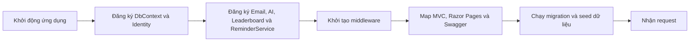
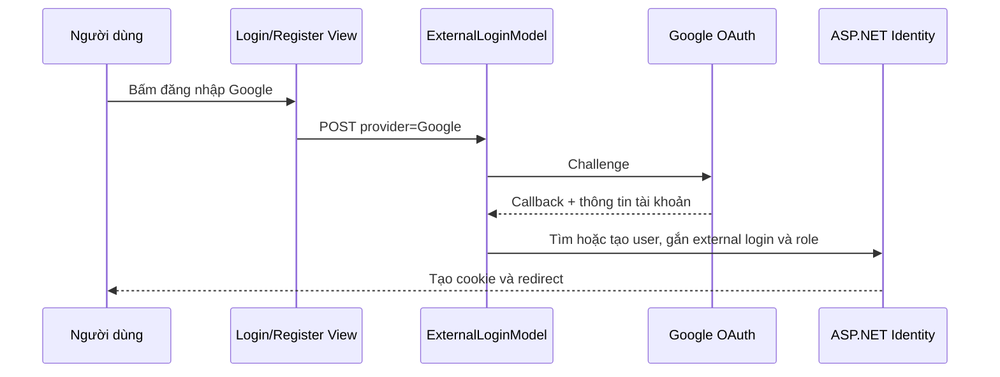
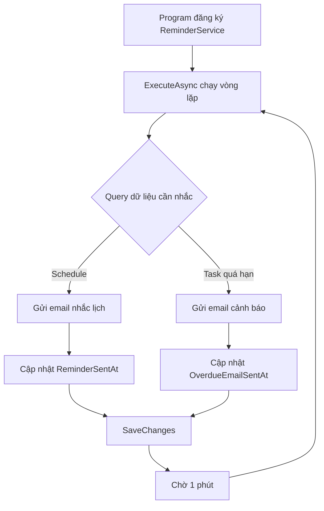
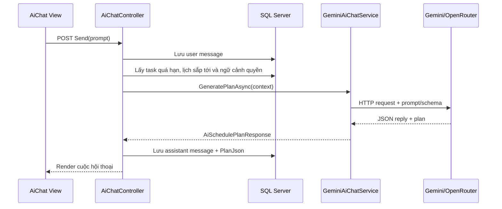

# Luồng xử lý các chức năng

Tài liệu này mô tả đường đi của dữ liệu trong Schedule Manager, từ thao tác trên giao diện đến action xử lý, service/helper, Entity Framework Core và kết quả trả về.

> Số dòng được ghi theo phiên bản hiện tại của mã nguồn. Khi code thay đổi, số dòng có thể dịch chuyển; tên file, class và method là mốc tham chiếu chính.

## Quy ước đọc flow

```text
View/Razor hoặc API client
    -> Route
    -> Controller/Razor Page handler
    -> Service/Helper
    -> ApplicationDbContext/Identity
    -> SQL Server hoặc dịch vụ ngoài
    -> View/JSON/File/Redirect
```

- **View** nhận thao tác của người dùng và gửi request.
- **Controller/Handler** kiểm tra quyền, validate dữ liệu và điều phối nghiệp vụ.
- **Service/Helper** xử lý nghiệp vụ dùng lại, gọi AI, SMTP hoặc tạo PDF.
- **ApplicationDbContext** đọc/ghi dữ liệu thông qua Entity Framework Core.
- **Kết quả** có thể là Razor View, JSON, PDF hoặc redirect.

## 1. Flow khởi động ứng dụng



1. Entry point bắt đầu tại [`Program.Main`](../Program.cs#L17).
2. Connection string được đọc và SQL Server DbContext được đăng ký tại [`Program.cs:30-34`](../Program.cs#L30-L34).
3. Identity, role, cookie và Google OAuth được đăng ký tại [`Program.cs:36-76`](../Program.cs#L36-L76).
4. Email, leaderboard, AI và background reminder được đưa vào DI container tại [`Program.cs:80-85`](../Program.cs#L80-L85).
5. Request đi qua routing, authentication và authorization tại [`Program.cs:153-163`](../Program.cs#L153-L163).
6. Trước khi phục vụ request, ứng dụng chạy migration và khởi tạo role/dữ liệu mẫu tại [`Program.cs:165-170`](../Program.cs#L165-L170) -> [`IdentitySeedData.InitializeAsync`](../Data/IdentitySeedData.cs#L17).

Các entity được ánh xạ vào database tại [`ApplicationDbContext.cs:13-19`](../Data/ApplicationDbContext.cs#L13-L19). Quan hệ `ScheduleItem -> TaskItem` và `AiChatConversation -> AiChatMessage` được cấu hình tại [`ApplicationDbContext.OnModelCreating`](../Data/ApplicationDbContext.cs#L21-L93).

## 2. Flow xác thực

### 2.1. Đăng ký bằng email và mật khẩu

```text
Register.cshtml form
    -> POST /Identity/Account/Register
    -> RegisterModel.OnPostAsync
    -> UserManager.CreateAsync
    -> gán role User
    -> SignInManager.SignInAsync
    -> redirect về returnUrl
```

1. Người dùng nhập thông tin tại [`Register.cshtml:42`](../Areas/Identity/Pages/Account/Register.cshtml#L42).
2. Form POST tới [`RegisterModel.OnPostAsync`](../Areas/Identity/Pages/Account/Register.cshtml.cs#L40-L76).
3. Handler bảo đảm role `User` tồn tại, tạo `IdentityUser`, gán role và đăng nhập tại [`Register.cshtml.cs:50-67`](../Areas/Identity/Pages/Account/Register.cshtml.cs#L50-L67).
4. Identity ghi dữ liệu vào các bảng `AspNetUsers`, `AspNetRoles` và `AspNetUserRoles`, sau đó redirect về trang yêu cầu ban đầu.

### 2.2. Đăng nhập bằng email và mật khẩu

```text
Login.cshtml form
    -> LoginModel.OnPostAsync
    -> SignInManager.PasswordSignInAsync
    -> kiểm tra role
    -> Admin hoặc returnUrl
```

1. Form bắt đầu tại [`Login.cshtml:42`](../Areas/Identity/Pages/Account/Login.cshtml#L42).
2. Handler nhận request tại [`LoginModel.OnPostAsync`](../Areas/Identity/Pages/Account/Login.cshtml.cs#L66-L96).
3. Mật khẩu được kiểm tra bởi `PasswordSignInAsync` tại [`Login.cshtml.cs:74`](../Areas/Identity/Pages/Account/Login.cshtml.cs#L74).
4. Nếu là Admin, handler chuyển tới `/Admin`; người dùng thường được chuyển tới `returnUrl` tại [`Login.cshtml.cs:77-85`](../Areas/Identity/Pages/Account/Login.cshtml.cs#L77-L85).

### 2.3. Đăng nhập Google



1. Nút Google nằm tại [`Login.cshtml:25`](../Areas/Identity/Pages/Account/Login.cshtml#L25) và [`Register.cshtml:25`](../Areas/Identity/Pages/Account/Register.cshtml#L25).
2. Request đi vào [`ExternalLoginModel.OnPostAsync`](../Areas/Identity/Pages/Account/ExternalLogin.cshtml.cs#L43-L46), sau đó tới [`StartExternalLoginAsync`](../Areas/Identity/Pages/Account/ExternalLogin.cshtml.cs#L125-L165).
3. `ConfigureExternalAuthenticationProperties` tạo callback và `ChallengeResult` chuyển trình duyệt tới Google tại [`ExternalLogin.cshtml.cs:157-164`](../Areas/Identity/Pages/Account/ExternalLogin.cshtml.cs#L157-L164).
4. Google gọi lại [`OnGetCallbackAsync`](../Areas/Identity/Pages/Account/ExternalLogin.cshtml.cs#L48-L122).
5. Handler đọc external login, thử đăng nhập, hoặc tạo user mới tại [`ExternalLogin.cshtml.cs:58-120`](../Areas/Identity/Pages/Account/ExternalLogin.cshtml.cs#L58-L120).
6. User mới được bảo đảm có role `User` tại [`EnsureUserRoleAsync`](../Areas/Identity/Pages/Account/ExternalLogin.cshtml.cs#L167-L177).

## 3. Flow dashboard trang chủ

```text
GET /
    -> route mặc định Home/Index
    -> HomeController.Index
    -> query ScheduleItems và TaskItems theo user
    -> HomeDashboardViewModel
    -> Views/Home/Index.cshtml
```

1. Route mặc định được khai báo tại [`Program.cs:160-163`](../Program.cs#L160-L163).
2. [`HomeController.Index`](../Controllers/HomeController.cs#L28-L113) tạo `HomeDashboardViewModel` và xác định user hiện tại.
3. Nếu user là Admin, request được chuyển tới Admin Dashboard tại [`HomeController.cs:41-44`](../Controllers/HomeController.cs#L41-L44).
4. Với user thường, controller query lịch và task tại [`HomeController.cs:48-55`](../Controllers/HomeController.cs#L48-L55).
5. Các chỉ số lịch hôm nay, task hoàn thành, task quá hạn và danh sách sắp tới được tính tại [`HomeController.cs:57-109`](../Controllers/HomeController.cs#L57-L109).
6. Model được render bởi [`Views/Home/Index.cshtml`](../Views/Home/Index.cshtml).

## 4. Flow quản lý lịch trình

Tất cả action của module lịch được bảo vệ bởi `[Authorize]` tại [`ScheduleController.cs:11`](../Controllers/ScheduleController.cs#L11).

### 4.1. Danh sách lịch

```text
GET /Schedule
    -> ScheduleController.Index
    -> BuildUserScheduleQuery
    -> ScheduleItems.Include(Tasks)
    -> Views/Schedule/Index.cshtml
```

- Entry view: [`Views/Schedule/Index.cshtml`](../Views/Schedule/Index.cshtml).
- Action: [`ScheduleController.Index`](../Controllers/ScheduleController.cs#L24-L38).
- Phạm vi dữ liệu: Admin có thể xem user được chọn; user thường chỉ xem dữ liệu của mình tại [`BuildUserScheduleQuery`](../Controllers/ScheduleController.cs#L345-L361).
- Kết quả gồm lịch và các task liên quan, sau đó được sắp xếp theo thời gian bắt đầu.

### 4.2. Tạo lịch

```text
GET /Schedule/Create -> tạo model mặc định -> Create.cshtml
POST /Schedule/Create -> validate -> gắn user -> Add -> SaveChanges -> /Schedule
```

1. Nút tạo lịch từ danh sách nằm tại [`Schedule/Index.cshtml:44`](../Views/Schedule/Index.cshtml#L44).
2. GET action tạo thời gian mặc định tại [`ScheduleController.Create GET`](../Controllers/ScheduleController.cs#L42-L51).
3. Form gửi dữ liệu tại [`Schedule/Create.cshtml:13`](../Views/Schedule/Create.cshtml#L13).
4. POST action kiểm tra thời gian, gắn `CreatedByUserId`, `CreatedByEmail`, thêm entity và lưu tại [`ScheduleController.Create POST`](../Controllers/ScheduleController.cs#L53-L73).
5. Dữ liệu đi vào `ApplicationDbContext.ScheduleItems` tại [`ApplicationDbContext.cs:13`](../Data/ApplicationDbContext.cs#L13).

### 4.3. Xem chi tiết

```text
Link chi tiết -> ScheduleController.Details
    -> ScheduleItems.Include(Tasks)
    -> kiểm tra quyền
    -> Views/Schedule/Details.cshtml
```

- Link mở chi tiết: [`Schedule/Index.cshtml:102`](../Views/Schedule/Index.cshtml#L102).
- Action và kiểm tra quyền: [`ScheduleController.Details`](../Controllers/ScheduleController.cs#L75-L90).
- View hiển thị lịch và task: [`Views/Schedule/Details.cshtml`](../Views/Schedule/Details.cshtml).

### 4.4. Chỉnh sửa lịch

```text
GET /Schedule/Edit/{id}
    -> tải lịch + task -> kiểm tra CanManage/CanEditToday -> Edit.cshtml
POST /Schedule/Edit/{id}
    -> validate -> cập nhật trường -> SaveChanges -> /Schedule
```

- GET action: [`ScheduleController.Edit GET`](../Controllers/ScheduleController.cs#L94-L115).
- Form: [`Schedule/Edit.cshtml:31`](../Views/Schedule/Edit.cshtml#L31).
- POST action: [`ScheduleController.Edit POST`](../Controllers/ScheduleController.cs#L118-L169).
- Kiểm tra quyền sở hữu: [`CanManage`](../Controllers/ScheduleController.cs#L379-L382).
- Quy tắc thời gian chỉnh sửa: [`CanEditToday`](../Controllers/ScheduleController.cs#L384-L387) và [`ValidateScheduleTime`](../Controllers/ScheduleController.cs#L389).

### 4.5. Xóa lịch

```text
GET Delete -> trang xác nhận
POST DeleteConfirmed -> kiểm tra quyền -> Remove ScheduleItem
    -> cascade xóa TaskItems -> SaveChanges -> /Schedule
```

- Trang xác nhận: [`ScheduleController.Delete`](../Controllers/ScheduleController.cs#L173-L186) -> [`Schedule/Delete.cshtml`](../Views/Schedule/Delete.cshtml).
- Form xác nhận: [`Schedule/Delete.cshtml:23`](../Views/Schedule/Delete.cshtml#L23).
- Xóa dữ liệu: [`ScheduleController.DeleteConfirmed`](../Controllers/ScheduleController.cs#L189-L208).
- Cascade `ScheduleItem -> TaskItem` được cấu hình tại [`ApplicationDbContext.cs:38-43`](../Data/ApplicationDbContext.cs#L38-L43).

### 4.6. Calendar

```text
GET /Schedule/Calendar
    -> Calendar.cshtml
    -> FullCalendar gọi /Schedule/GetEvents
    -> ScheduleController.GetEvents
    -> query ScheduleItems/TaskItems
    -> JSON events
    -> FullCalendar render
```

- Trang calendar: [`ScheduleController.Calendar`](../Controllers/ScheduleController.cs#L211-L215).
- URL dữ liệu được tạo tại [`Calendar.cshtml:236`](../Views/Schedule/Calendar.cshtml#L236) và truyền vào FullCalendar tại [`Calendar.cshtml:336`](../Views/Schedule/Calendar.cshtml#L336).
- Action trả JSON: [`ScheduleController.GetEvents`](../Controllers/ScheduleController.cs#L218-L330).

### 4.7. Xuất PDF lịch

```text
Nút Xuất PDF -> ScheduleController.ExportPdf
    -> query lịch theo user
    -> SchedulePdfGenerator.Generate
    -> trả File application/pdf
```

- Nút xuất: [`Schedule/Index.cshtml:41`](../Views/Schedule/Index.cshtml#L41).
- Controller: [`ScheduleController.ExportPdf`](../Controllers/ScheduleController.cs#L333-L342).
- PDF generator: [`SchedulePdfGenerator.Generate`](../Helpers/SchedulePdfGenerator.cs#L10-L67).

## 5. Flow quản lý task

Module task được bảo vệ bởi `[Authorize]` tại [`TasksController.cs:11`](../Controllers/TasksController.cs#L11).

### 5.1. Danh sách và lọc task

```text
GET /Tasks
    -> TasksController.Index
    -> TaskItems.Include(ScheduleItem)
    -> giới hạn theo user
    -> Views/Tasks/Index.cshtml
    -> lọc tức thời phía client
```

- Action tải task: [`TasksController.Index`](../Controllers/TasksController.cs#L24-L47).
- Controller trả toàn bộ task được phép xem để giao diện lọc không reload.
- View và bộ lọc: [`Views/Tasks/Index.cshtml`](../Views/Tasks/Index.cshtml).

### 5.2. Tạo task

```text
GET /Tasks/Create -> tải danh sách lịch của user -> Create.cshtml
POST /Tasks/Create -> kiểm tra lịch và quyền -> NormalizeTask
    -> gắn user -> Add -> SaveChanges -> Tasks hoặc Schedule/Edit
```

1. Nút tạo task độc lập nằm tại [`Tasks/Index.cshtml:18`](../Views/Tasks/Index.cshtml#L18).
2. GET action tải các lịch có thể gắn task tại [`TasksController.Create GET`](../Controllers/TasksController.cs#L51-L72).
3. Form nằm tại [`Tasks/Create.cshtml:23`](../Views/Tasks/Create.cshtml#L23). Trang sửa lịch cũng có form tạo task nhanh tại [`Schedule/Edit.cshtml:92`](../Views/Schedule/Edit.cshtml#L92).
4. POST action kiểm tra lịch, quyền sở hữu và thời gian tại [`TasksController.Create POST`](../Controllers/TasksController.cs#L74-L135).
5. Dữ liệu được chuẩn hóa màu/trạng thái tại [`NormalizeTask`](../Controllers/TasksController.cs#L275-L285), lưu vào [`ApplicationDbContext.TaskItems`](../Data/ApplicationDbContext.cs#L15).

### 5.3. Sửa task

```text
GET /Tasks/Edit/{id} -> tải task + lịch -> kiểm tra quyền -> Edit.cshtml
POST /Tasks/Edit/{id} -> cập nhật -> NormalizeTask -> SaveChanges -> Schedule/Edit
```

- GET action: [`TasksController.Edit GET`](../Controllers/TasksController.cs#L139-L155).
- Form: [`Tasks/Edit.cshtml:16`](../Views/Tasks/Edit.cshtml#L16).
- POST action: [`TasksController.Edit POST`](../Controllers/TasksController.cs#L158-L197).

### 5.4. Xóa task

```text
GET Delete -> trang xác nhận
POST DeleteConfirmed -> kiểm tra quyền -> Remove -> SaveChanges -> Schedule/Edit
```

- GET action: [`TasksController.Delete`](../Controllers/TasksController.cs#L201-L217).
- Form xác nhận: [`Tasks/Delete.cshtml:23`](../Views/Tasks/Delete.cshtml#L23).
- POST action: [`TasksController.DeleteConfirmed`](../Controllers/TasksController.cs#L220-L243).

## 6. Flow email nhắc lịch và task quá hạn



1. Service được đăng ký tại [`Program.cs:85`](../Program.cs#L85).
2. Vòng lặp nền bắt đầu tại [`ReminderService.ExecuteAsync`](../Services/ReminderService.cs#L18-L199).
3. Lịch cần nhắc được lọc tại [`ReminderService.cs:31-37`](../Services/ReminderService.cs#L31-L37).
4. Service gọi `IEmailService.SendEmailAsync`, rồi cập nhật `ReminderSentAt` tại [`ReminderService.cs:39-65`](../Services/ReminderService.cs#L39-L65).
5. Task quá hạn trong bảy ngày và chưa gửi email được lọc tại [`ReminderService.cs:71-80`](../Services/ReminderService.cs#L71-L80).
6. Email task được gửi và `OverdueEmailSentAt` được cập nhật tại [`ReminderService.cs:175-187`](../Services/ReminderService.cs#L175-L187).
7. [`EmailService.SendEmailAsync`](../Services/EmailService.cs#L19-L43) tạo `MailMessage`, kết nối SMTP và gửi email.
8. Trạng thái xử lý được lưu, sau đó service chờ một phút tại [`ReminderService.cs:191-198`](../Services/ReminderService.cs#L191-L198).

## 7. Flow AI Chat

### 7.1. Gửi tin nhắn và nhận kế hoạch



1. Form gửi chat nằm tại [`AiChat/Index.cshtml:211`](../Views/AiChat/Index.cshtml#L211).
2. [`AiChatController.Send`](../Controllers/AiChatController.cs#L52-L116) lấy hoặc tạo conversation, lưu tin nhắn người dùng và gọi AI.
3. Conversation được tạo/tải tại [`GetOrCreateConversationAsync`](../Controllers/AiChatController.cs#L354-L386).
4. Ngữ cảnh AI gồm task quá hạn, lịch sắp tới, leaderboard và dữ liệu Admin tại [`BuildAiContextAsync`](../Controllers/AiChatController.cs#L428-L679).
5. [`GeminiAiChatService.GeneratePlanAsync`](../Services/GeminiAiChatService.cs#L30-L98) chọn Gemini hoặc OpenRouter dựa vào endpoint.
6. Request Gemini được tạo tại [`BuildGeminiRequest`](../Services/GeminiAiChatService.cs#L100-L158); request OpenRouter tại [`BuildOpenRouterRequest`](../Services/GeminiAiChatService.cs#L160-L201).
7. Prompt hệ thống được ghép tại [`BuildPrompt`](../Services/GeminiAiChatService.cs#L203-L243).
8. JSON phản hồi được parse và chuẩn hóa tại [`DeserializePlan`](../Services/GeminiAiChatService.cs#L327-L359) -> [`NormalizePlan`](../Services/GeminiAiChatService.cs#L442-L462).
9. Controller lưu câu trả lời và `PlanJson` vào `AiChatMessages` tại [`AiChatController.cs:94-112`](../Controllers/AiChatController.cs#L94-L112).

### 7.2. Áp dụng kế hoạch AI

```text
Form Apply
    -> AiChatController.Apply
    -> đọc PlanJson từ assistant message
    -> tạo ScheduleItem
    -> tạo các TaskItem thuộc lịch
    -> SaveChanges
    -> lưu tin nhắn xác nhận
    -> redirect /Schedule
```

- Form xem trước và áp dụng: [`AiChat/Index.cshtml:103`](../Views/AiChat/Index.cshtml#L103).
- Action xử lý: [`AiChatController.Apply`](../Controllers/AiChatController.cs#L119-L239).
- Tạo lịch tại [`AiChatController.cs:148-171`](../Controllers/AiChatController.cs#L148-L171).
- Tạo task thuộc lịch tại [`AiChatController.cs:173-204`](../Controllers/AiChatController.cs#L173-L204).
- Lưu tin nhắn xác nhận và redirect tại [`AiChatController.cs:205-233`](../Controllers/AiChatController.cs#L205-L233).

### 7.3. Xóa hội thoại

- Form xóa nằm tại [`AiChat/Index.cshtml:36`](../Views/AiChat/Index.cshtml#L36).
- [`AiChatController.Clear`](../Controllers/AiChatController.cs#L242-L282) chỉ xóa conversation thuộc user hiện tại, xóa messages liên quan rồi redirect về chat.
- Quan hệ cascade conversation-message nằm tại [`ApplicationDbContext.cs:88-93`](../Data/ApplicationDbContext.cs#L88-L93).

## 8. Flow thống kê hoạt động

```text
Activity filter form
    -> GET /Activity?fromDate&toDate&groupBy
    -> ActivityController.Index
    -> query TaskItems của user
    -> chia khoảng ngày/tuần/tháng
    -> ActivityDashboardViewModel
    -> Activity/Index.cshtml render biểu đồ
```

1. Bộ lọc bắt đầu tại [`Activity/Index.cshtml:15`](../Views/Activity/Index.cshtml#L15).
2. [`ActivityController.Index`](../Controllers/ActivityController.cs#L29-L267) chuẩn hóa khoảng ngày và lấy task của user.
3. Dữ liệu được chia interval tại [`GetTimeIntervals`](../Controllers/ActivityController.cs#L279-L316).
4. Controller tính task tạo mới, hoàn thành, quá hạn, xu hướng và streak rồi ghi vào `ActivityDashboardViewModel` tại [`ActivityController.cs:130-267`](../Controllers/ActivityController.cs#L130-L267).
5. View sử dụng model để render thẻ thống kê, biểu đồ và bảng chi tiết tại [`Views/Activity/Index.cshtml`](../Views/Activity/Index.cshtml).

## 9. Flow báo cáo và PDF

### 9.1. Báo cáo động trên giao diện

```text
Reports/Index.cshtml thay đổi bộ lọc
    -> fetch /Reports/GetStats
    -> ReportsController.GetStats
    -> CountAsync ScheduleItems/TaskItems
    -> JSON
    -> JavaScript cập nhật dashboard
```

- Trang báo cáo được chuẩn bị bởi [`ReportsController.Index`](../Controllers/ReportsController.cs#L24-L62).
- JavaScript gọi endpoint tại [`Reports/Index.cshtml:995`](../Views/Reports/Index.cshtml#L995).
- [`ReportsController.GetStats`](../Controllers/ReportsController.cs#L66-L102) giới hạn dữ liệu theo user/quyền Admin, áp dụng khoảng ngày và trả JSON.

### 9.2. Xuất báo cáo PDF

```text
Form ExportPdf
    -> ReportsController.ExportPdf
    -> chọn loại báo cáo và phạm vi user
    -> query database
    -> ReportPdfGenerator
    -> trả file PDF
```

- Form xuất PDF: [`Reports/Index.cshtml:397`](../Views/Reports/Index.cshtml#L397).
- Controller điều phối: [`ReportsController.ExportPdf`](../Controllers/ReportsController.cs#L105-L294).
- Báo cáo tổng quan hệ thống: [`GenerateSystemOverview`](../Helpers/ReportPdfGenerator.cs#L455-L595).
- Báo cáo danh sách người dùng: [`GenerateUsersReport`](../Helpers/ReportPdfGenerator.cs#L598-L693).
- Báo cáo lịch/task cá nhân: [`ReportPdfGenerator.Generate`](../Helpers/ReportPdfGenerator.cs#L11-L452).
- Controller trả byte PDF bằng `File(...)` tại [`ReportsController.cs:284-294`](../Controllers/ReportsController.cs#L284-L294).

## 10. Flow bảng xếp hạng

```text
Leaderboard filter
    -> LeaderboardController.Index
    -> LeaderboardService.BuildRowsAsync
    -> query UserProfiles + completed TaskItems
    -> LeaderboardHelper.TaskScore
    -> sắp xếp và gán rank
    -> EnsureMonthlyAwardsAsync
    -> LeaderboardViewModel
    -> Leaderboard/Index.cshtml
```

1. Bộ lọc kỳ xếp hạng nằm tại [`Leaderboard/Index.cshtml:50`](../Views/Leaderboard/Index.cshtml#L50).
2. [`LeaderboardController.Index`](../Controllers/LeaderboardController.cs#L20-L65) tính khoảng thời gian và gọi service.
3. [`LeaderboardService.BuildRowsAsync`](../Services/LeaderboardService.cs#L20-L78) lấy user role `User`, profile công khai và task hoàn thành.
4. Điểm task được tính bởi [`LeaderboardHelper.TaskScore`](../Helpers/LeaderboardHelper.cs#L19-L23), gồm điểm ưu tiên và thưởng đúng hạn.
5. Service sắp xếp kết quả và trả các `LeaderboardEntry`.
6. Giải thưởng tháng được tạo hoặc tải tại [`EnsureMonthlyAwardsAsync`](../Services/LeaderboardService.cs#L81-L125).
7. Controller ánh xạ sang `LeaderboardViewModel` và render [`Views/Leaderboard/Index.cshtml`](../Views/Leaderboard/Index.cshtml).

## 11. Flow hồ sơ người dùng

### 11.1. Xem hồ sơ cá nhân hoặc công khai

```text
/Profile hoặc /Profile/user/{slug}
    -> ProfileController.Index/PublicProfile
    -> GetOrCreateProfileAsync
    -> BuildProfileViewModelAsync
    -> query lịch, task, streak, rank, awards
    -> Views/Profile/Details.cshtml
```

- Hồ sơ hiện tại: [`ProfileController.Index`](../Controllers/ProfileController.cs#L49-L60).
- Hồ sơ công khai theo slug: [`ProfileController.PublicProfile`](../Controllers/ProfileController.cs#L63-L87).
- Hồ sơ theo user id: [`ProfileController.Details`](../Controllers/ProfileController.cs#L90-L102).
- Profile thiếu được tạo tự động tại [`GetOrCreateProfileAsync`](../Controllers/ProfileController.cs#L317-L342).
- Model tổng hợp lịch, task, streak, rank và award tại [`BuildProfileViewModelAsync`](../Controllers/ProfileController.cs#L185-L233).
- Streak và biểu đồ hoàn thành dùng [`ActivityStatsHelper`](../Helpers/ActivityStatsHelper.cs#L6-L62).

### 11.2. Chỉnh sửa hồ sơ và upload ảnh

```text
GET /Profile/Edit -> tải EditProfileViewModel -> Edit.cshtml
POST /Profile/Edit -> validate dữ liệu/ảnh
    -> tạo slug nếu thiếu
    -> lưu avatar/cover vào wwwroot/uploads/profiles/{userId}
    -> SaveChanges -> /Profile
```

- GET action: [`ProfileController.Edit GET`](../Controllers/ProfileController.cs#L104-L129).
- Form multipart: [`Profile/Edit.cshtml:12`](../Views/Profile/Edit.cshtml#L12).
- POST action: [`ProfileController.Edit POST`](../Controllers/ProfileController.cs#L132-L182).
- Kiểm tra loại và kích thước ảnh: [`ValidateImage`](../Controllers/ProfileController.cs#L423-L440).
- Lưu file ảnh: [`SaveProfileImageAsync`](../Controllers/ProfileController.cs#L442-L456).
- Tạo slug duy nhất: [`CreateUniqueSlugAsync`](../Controllers/ProfileController.cs#L345-L359).

### 11.3. Báo cáo người dùng

```text
Profile Details -> fetch POST /Profile/Report
    -> ProfileController.SubmitReport
    -> kiểm tra dữ liệu và báo cáo gần đây
    -> Add UserReport -> SaveChanges -> JSON
```

- Giao diện gửi request tại [`Profile/Details.cshtml:475`](../Views/Profile/Details.cshtml#L475).
- Controller xử lý tại [`ProfileController.SubmitReport`](../Controllers/ProfileController.cs#L464-L501).
- Báo cáo được ghi vào [`ApplicationDbContext.UserReports`](../Data/ApplicationDbContext.cs#L17).

## 12. Flow tìm kiếm

```text
Thanh tìm kiếm layout
    -> nhập từ khóa
    -> site.js fetch /Search/Live
    -> SearchController.Live
    -> BuildResultsAsync
    -> query ScheduleItems + TaskItems (+ UserProfiles nếu Admin)
    -> JSON gợi ý

Submit form
    -> SearchController.Index
    -> SearchViewModel
    -> Views/Search/Index.cshtml
```

- Form tìm kiếm chung nằm tại [`Shared/_Layout.cshtml:172`](../Views/Shared/_Layout.cshtml#L172).
- Live search được gọi tại [`wwwroot/js/site.js:62`](../wwwroot/js/site.js#L62).
- Endpoint live: [`SearchController.Live`](../Controllers/SearchController.cs#L36-L40).
- Truy vấn và phân quyền kết quả: [`BuildResultsAsync`](../Controllers/SearchController.cs#L42-L117).
- Trang kết quả đầy đủ: [`SearchController.Index`](../Controllers/SearchController.cs#L24-L32) -> [`Views/Search/Index.cshtml`](../Views/Search/Index.cshtml).

## 13. Flow cài đặt quyền riêng tư

```text
GET /Settings -> lấy/tạo UserProfile -> SettingsViewModel -> Settings/Index
POST UpdateProfileVisibility -> cập nhật IsProfilePublic -> SaveChanges -> redirect
```

- Trang cài đặt: [`SettingsController.Index`](../Controllers/SettingsController.cs#L29-L42).
- Form: [`Settings/Index.cshtml:27`](../Views/Settings/Index.cshtml#L27).
- Action cập nhật: [`SettingsController.UpdateProfileVisibility`](../Controllers/SettingsController.cs#L48-L64).
- Profile được tạo nếu chưa tồn tại tại [`GetOrCreateProfileAsync`](../Controllers/SettingsController.cs#L67-L85).

## 14. Flow quản trị

Toàn bộ `AdminController` yêu cầu role `Admin` tại [`AdminController.cs:12`](../Controllers/AdminController.cs#L12).

### 14.1. Admin Dashboard

```text
GET /Admin?section=...
    -> AdminController.Index
    -> query Users, Roles, Schedules, Tasks, Reports
    -> tính thống kê và notifications
    -> AdminDashboardViewModel
    -> Views/Admin/Index.cshtml
```

- Controller tổng hợp dashboard: [`AdminController.Index`](../Controllers/AdminController.cs#L33-L406).
- Model được tạo tại [`AdminController.cs:372-406`](../Controllers/AdminController.cs#L372-L406).
- Giao diện theo từng section: [`Views/Admin/Index.cshtml`](../Views/Admin/Index.cshtml).
- Biểu đồ gọi [`ChartData`](../Controllers/AdminController.cs#L500-L553) từ [`Admin/Index.cshtml:1193`](../Views/Admin/Index.cshtml#L1193).
- Thẻ tổng quan gọi [`OverviewStats`](../Controllers/AdminController.cs#L557-L589) từ [`Admin/Index.cshtml:1206`](../Views/Admin/Index.cshtml#L1206).

### 14.2. Quản lý tài khoản

| Thao tác | View gửi request | Action xử lý | Điểm kết thúc |
| --- | --- | --- | --- |
| Gán Admin | [`Admin/Index.cshtml:388`](../Views/Admin/Index.cshtml#L388) | [`MakeAdmin`](../Controllers/AdminController.cs#L597-L638) | `UserManager.AddToRoleAsync`, gửi email, redirect |
| Gỡ Admin | [`Admin/Index.cshtml:379`](../Views/Admin/Index.cshtml#L379) | [`RemoveAdmin`](../Controllers/AdminController.cs#L641-L699) | đổi role, gửi email, redirect |
| Khóa user | [`Admin/Index.cshtml:406`](../Views/Admin/Index.cshtml#L406) | [`Lock`](../Controllers/AdminController.cs#L702-L751) | `SetLockoutEndDateAsync`, gửi email |
| Mở khóa | [`Admin/Index.cshtml:397`](../Views/Admin/Index.cshtml#L397) | [`Unlock`](../Controllers/AdminController.cs#L754-L795) | cập nhật lockout, gửi email |
| Xóa user | [`Admin/Index.cshtml:413`](../Views/Admin/Index.cshtml#L413) | [`Delete`](../Controllers/AdminController.cs#L798-L851) | xóa dữ liệu liên quan và `UserManager.DeleteAsync` |

### 14.3. Xử lý báo cáo vi phạm

```text
Admin Reports/Notifications
    -> WarnUser hoặc LockUserFromReport hoặc DismissReport
    -> cập nhật UserReport.Status/AdminNote/HandledAt
    -> có thể khóa IdentityUser và gửi email
    -> SaveChanges -> Admin notifications
```

- Cảnh báo user: form [`Admin/Index.cshtml:728`](../Views/Admin/Index.cshtml#L728) -> [`WarnUser`](../Controllers/AdminController.cs#L895-L943).
- Khóa từ báo cáo: form [`Admin/Index.cshtml:758`](../Views/Admin/Index.cshtml#L758) -> [`LockUserFromReport`](../Controllers/AdminController.cs#L946-L1000).
- Bỏ qua báo cáo: form [`Admin/Index.cshtml:672`](../Views/Admin/Index.cshtml#L672) -> [`DismissReport`](../Controllers/AdminController.cs#L1003-L1015).
- Các flow gửi mail đều kết thúc tại [`EmailService.SendEmailAsync`](../Services/EmailService.cs#L19-L43).

### 14.4. PDF quản trị

- Nút báo cáo user tại [`Admin/Index.cshtml:885`](../Views/Admin/Index.cshtml#L885) -> [`AdminController.ExportUsersPdf`](../Controllers/AdminController.cs#L410-L424) -> [`AdminPdfGenerator.GenerateUserStats`](../Helpers/AdminPdfGenerator.cs#L9-L96).
- Báo cáo theo loại tại [`Admin/Index.cshtml:999`](../Views/Admin/Index.cshtml#L999) -> [`AdminController.ExportReportPdf`](../Controllers/AdminController.cs#L428-L496) -> [`ReportPdfGenerator.Generate`](../Helpers/ReportPdfGenerator.cs#L11-L452).

## 15. Flow REST API và Swagger

```text
API client
    -> /api/{module}
    -> Authentication/Authorization
    -> ApiController nhận DTO JSON
    -> kiểm tra quyền sở hữu/role
    -> ApplicationDbContext hoặc service
    -> SaveChanges nếu có thay đổi
    -> JSON + HTTP status code
```

Swagger được đăng ký tại [`Program.cs:89-132`](../Program.cs#L89-L132), bật middleware tại [`Program.cs:142-147`](../Program.cs#L142-L147) và truy cập qua `/swagger`.

| Nhóm API | Route/action code | Flow chính |
| --- | --- | --- |
| Schedule | [`SchedulesApiController`](../Controllers/Api/SchedulesApiController.cs#L16-L204) | DTO -> kiểm tra user -> CRUD `ScheduleItems` -> JSON |
| Task | [`TasksApiController`](../Controllers/Api/TasksApiController.cs#L17-L250) | DTO -> kiểm tra lịch/quyền -> CRUD `TaskItems` -> JSON |
| Profile | [`ProfileApiController`](../Controllers/Api/ProfileApiController.cs#L20-L159) | đọc/cập nhật profile, public profile, tạo report |
| Leaderboard | [`LeaderboardApiController`](../Controllers/Api/LeaderboardApiController.cs#L14-L90) | query kỳ -> `ILeaderboardService` -> DTO JSON |
| AI | [`AiChatApiController`](../Controllers/Api/AiChatApiController.cs#L21-L302) | lưu conversation -> tạo context -> `IAiChatService` -> JSON |
| Admin | [`AdminApiController`](../Controllers/Api/AdminApiController.cs#L18-L335) | role Admin -> quản lý user/report -> JSON |

DTO đầu vào/đầu ra được định nghĩa tại [`DTOs/ApiDTOs.cs`](../DTOs/ApiDTOs.cs).

## 16. Tóm tắt luồng dữ liệu theo bảng

| Chức năng | Điểm bắt đầu | Điều phối | Xử lý/lưu trữ | Điểm kết thúc |
| --- | --- | --- | --- | --- |
| Đăng ký | `Register.cshtml` | `RegisterModel.OnPostAsync` | Identity `UserManager` | Cookie + redirect |
| Google Login | Login/Register Google form | `ExternalLoginModel` | Google OAuth + Identity | Cookie + redirect |
| Dashboard | `/` | `HomeController.Index` | `ScheduleItems`, `TaskItems` | `Home/Index` |
| Lịch | `Schedule/*` views | `ScheduleController` | `ScheduleItems` | View/JSON/PDF |
| Task | `Tasks/*` views | `TasksController` | `TaskItems` | View/redirect |
| Nhắc email | Hosted service | `ReminderService` | SQL Server + SMTP | Email + timestamp |
| AI Chat | `AiChat/Index` | `AiChatController` | AI service + chat tables | Reply/plan/view |
| Hoạt động | `Activity/Index` | `ActivityController` | Task query + ViewModel | Biểu đồ Razor/JS |
| Báo cáo | `Reports/Index` | `ReportsController` | Query + PDF helper | JSON/PDF |
| Xếp hạng | `Leaderboard/Index` | `LeaderboardController` | `LeaderboardService` | View + awards |
| Hồ sơ | `Profile/*` | `ProfileController` | `UserProfiles`, uploads | Profile view |
| Tìm kiếm | Layout search | `SearchController` | Schedule/task/profile query | JSON/View |
| Admin | `Admin/Index` | `AdminController` | Identity + toàn bộ DbSets | Dashboard/email/PDF |
| REST API | `/api/*` | API controllers | DTO + DbContext/services | JSON/status code |

## 17. Cách trình bày một flow khi bảo vệ

Một flow nên được trình bày theo năm ý:

1. **Trigger:** người dùng bấm gì hoặc hệ thống kích hoạt khi nào.
2. **Route:** request đi vào URL/action nào.
3. **Business rule:** controller kiểm tra quyền và dữ liệu gì.
4. **Data/service:** đọc ghi bảng nào hoặc gọi dịch vụ ngoài nào.
5. **Response:** trả view, JSON, PDF, email hay redirect tới đâu.

Ví dụ ngắn với tạo lịch:

> Người dùng mở form `Schedule/Create`. Form POST vào `ScheduleController.Create`. Controller kiểm tra thời gian, lấy user hiện tại, gắn thông tin người tạo và lưu `ScheduleItem` qua `ApplicationDbContext`. Sau khi `SaveChangesAsync` thành công, hệ thống redirect về danh sách lịch.
